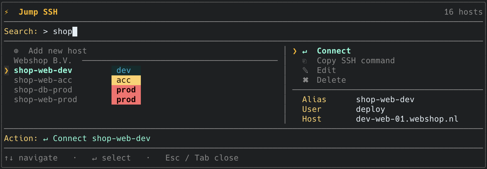

<div align="center">

# ⚡ jump

**Native SSH launcher for the terminal**




</div>

**jump** is a fast SSH launcher for the terminal. It reads your `~/.ssh/config`, lets you search and connect to hosts by alias, hostname, user, or metadata — with a fuzzy TUI picker, a real-time connect spinner, and a managed config layer that keeps your hosts organised.

---

## Features

- **Fuzzy search** across alias, hostname, user, tags, app, environment, and description
- **TUI picker** with keyboard navigation, action panel, and inline management
- **Smart direct connect** — jumps straight to a host when the match is unambiguous
- **Managed config** — add, edit, and delete hosts in `~/.ssh/config.d/jump.conf` without touching your existing config
- **Metadata** — attach app codes, environments, tags, and descriptions as inline SSH config comments
- **History & recency scoring** — frequently and recently used hosts rank higher
- **Clipboard support** — copy any SSH command to clipboard
- **TCP ping** — check if a host is reachable before connecting
- **JSON output** — all list/scan/history commands support `--json` for scripting
- **Cross-platform** — macOS, Linux, Windows (amd64 + arm64)

---

## Requirements

- macOS, Linux, or Windows (amd64 / arm64)
- `ssh` binary on `$PATH` (OpenSSH — PuTTY is not supported)
- `~/.ssh/config` readable
- Go 1.21+ — only when building from source

---

## Installation

**macOS / Linux:**

```bash
curl -fsSL https://raw.githubusercontent.com/denniseilander/jump/main/install.sh | sh
```

**Windows (PowerShell):**

```powershell
irm https://raw.githubusercontent.com/denniseilander/jump/main/install.ps1 | iex
```

<details>
<summary>Other installation options</summary>

**With Go:**

```bash
go install github.com/denniseilander/jump/cmd/jump@latest
```

Make sure `$(go env GOPATH)/bin` is on your `$PATH`.

**From source:**

```bash
git clone https://github.com/denniseilander/jump.git
cd jump
make install
```

**Manual download:**

Download the binary for your platform from the [Releases](https://github.com/denniseilander/jump/releases) page and place it on your `$PATH`.

</details>

---

## Getting started

### 1. Initialise

Run once after installing:

```bash
jump init
```

Creates `~/.ssh/config.d/jump.conf` and adds an `Include` line to your existing `~/.ssh/config`. Your current config is untouched.

### 2. Add your first host

```bash
jump add
```

jump prompts for the details:

```
Add a new SSH host to jump's managed config.

App/project code (e.g. myapp, api): myapp
Project name (optional, e.g. My Project): My App
Environment [prod/acc/dev/test]: prod
Service/role (optional, e.g. gateway, web, db):
  → alias: "myapp-prod"

HostName: prod-01.example.com
User []: deploy
Port [22]:
IdentityFile []: ~/.ssh/id_ed25519
Description [MY APP connection [prod]]:
```

### 3. Connect

```bash
jump myapp prod      # search and connect directly
jump                 # open TUI picker
```

Run `jump doctor` if anything looks off.

---

## Usage

```bash
jump [query...]             # search and connect (opens TUI on multiple matches)
jump                        # open TUI picker (all hosts)
jump myapp production       # multi-term search
jump -                      # reconnect to last used host
jump --print myapp prod     # print ssh command, do not connect
jump --json myapp           # output match as JSON
```

<details>
<summary>All commands</summary>

### Search & inspect

| Command | Description |
|---|---|
| `jump list [--json]` | List all known hosts, grouped by client |
| `jump show <alias>` | Show full details for a host |
| `jump scan [--json]` | Scan SSH config files and show stats |
| `jump explain <query>` | Show search score breakdown for a query |
| `jump aliases [--env e] [--tag t]` | Print host aliases (for scripting) |
| `jump ping <query>` | Check TCP reachability on SSH port |

### Connect

| Command | Description |
|---|---|
| `jump -` | Reconnect to the last used host |
| `jump recent [n]` | List recent hosts; connect to the nth entry |
| `jump history [--limit n]` | Show full connection history |
| `jump copy <query>` | Copy SSH command to clipboard |

### Manage hosts

| Command | Description |
|---|---|
| `jump init` | Initialise managed SSH config |
| `jump add` | Add a new managed host interactively |
| `jump bulk-add` | Add multiple hosts from a template (multi-environment) |
| `jump edit <alias>` | Edit a managed host |
| `jump rename <old> <new>` | Rename a host alias |
| `jump delete <alias>` | Delete a managed host |
| `jump tag <alias> <tag...>` | Add tags to a host |
| `jump describe <alias> <text>` | Set a host description |
| `jump set-client <code> <name>` | Set client name on all hosts with matching app code |

### Config & tools

| Command | Description |
|---|---|
| `jump config` | View and edit jump preferences |
| `jump doctor` | Validate jump and SSH setup |
| `jump open-config [--managed\|--ssh\|--metadata\|--history\|--config]` | Open a config file in your editor |

### Flags

| Flag | Description |
|---|---|
| `--print` | Print SSH command without executing |
| `--json` | Machine-readable JSON output |
| `--plain` | Disable colours and styling |
| `--no-color` | Disable colours |
| `--limit <n>` | Limit number of results shown (default: 20) |
| `--pick` | Always open the TUI picker, even on a strong match |
| `--no-tui` | Disable TUI; use classic numbered CLI picker |

</details>

---

## TUI

Open with `jump` or `jump <query>`. Type to filter in real time.

| Key | Action |
|---|---|
| `↑` / `↓` | Move cursor |
| `Enter` | Connect to selected host |
| `Tab` | Open action panel (connect, copy, edit, delete) |
| `Esc` | Clear search / quit |
| `q` | Quit (when search is empty) |
| `Ctrl+C` | Quit |

---

## Metadata

Attach optional metadata to any `Host` block via an inline comment:

```sshconfig
# jump: app=myapp client="My Project" env=prod tags=web,production description="Production web server"
Host myapp-web-prod
  HostName prod-01.example.com
  User deploy
  Port 22
```

| Key | Description |
|---|---|
| `app` | Application or project code |
| `client` | Human-readable client or project name |
| `env` | Environment (`prod`, `acc`, `dev`, `test`) |
| `tags` | Comma-separated list of tags |
| `description` | Free-text description |

All metadata fields are searchable. Environment synonyms are resolved automatically — `production` matches `prod`, `prd`, and `productie`.

---

## Managed config

`jump init` sets up the following structure:

```
~/.ssh/config              ← your existing config (Include line added at top)
~/.ssh/config.d/jump.conf  ← managed by jump
```

Hosts added via `jump add` or `jump bulk-add` are written to `jump.conf`, leaving your existing `~/.ssh/config` untouched. Before every write, jump automatically backs up `jump.conf` to `~/.config/jump/backups/`.

---

## Security & privacy

- **Reads, never modifies** your existing `~/.ssh/config` — jump only appends an `Include` line on `jump init`, nothing else
- **No credentials stored** — jump never reads, stores, or transmits passwords, private keys, or passphrases
- **No network calls** — jump makes no outbound connections except the SSH session you explicitly initiate
- **Local data only** — history and metadata are stored in `~/.config/jump/` on your machine, never synced or sent anywhere
- **SSH handles auth** — all authentication is delegated entirely to your existing SSH client and agent
- **Managed config is plain text** — `~/.ssh/config.d/jump.conf` is a standard SSH config file, human-readable and auditable at any time
- **Automatic backups** — before every write, jump backs up `jump.conf` to `~/.config/jump/backups/`

---

## License

[MIT](LICENSE)
